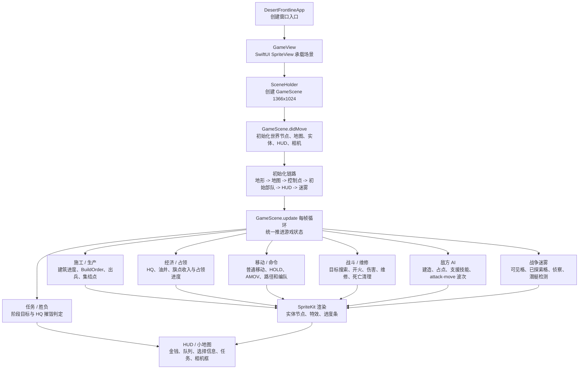
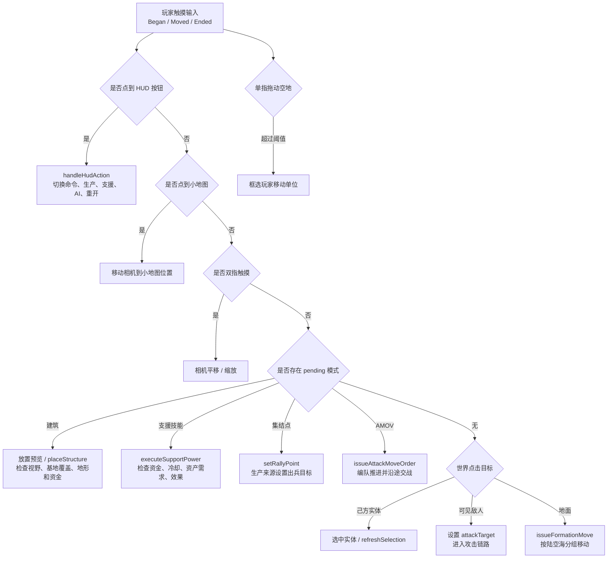
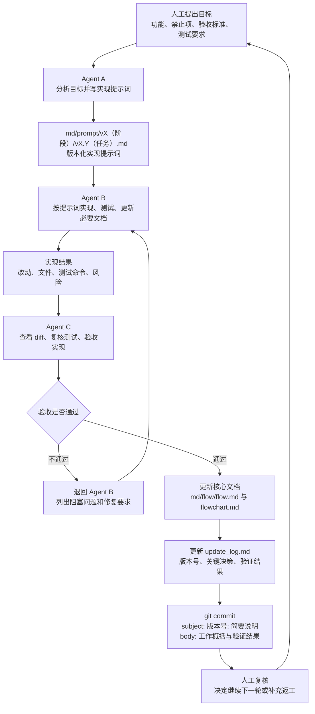

# 项目流程图

本文用 Mermaid 图把 `md/flow/flow.md` 的核心逻辑可视化。每张图前都有中文读图说明，便于人工快速检查当前项目运行链路。

## 1. 项目核心逻辑图

读图说明：从 App 启动开始，SwiftUI 只负责承载 SpriteKit；所有游戏运行态进入 `GameScene`。每帧 update 推进各系统，最后更新节点渲染、HUD、小地图和胜负状态。

## 2. 玩家输入与命令流程图

读图说明：触摸输入会先判断 HUD 和小地图，再处理 pending 模式。建筑放置、支援技能、集结点和 attack-move 都是互斥 pending 状态，最后才进入普通选择、攻击或移动。

## 3. Agent 迭代流程图

读图说明：人工提出目标和最终复核结论；Agent A 负责设计版本化提示词，Agent B 负责实现和测试，Agent C 负责验收。验收不通过则退回 Agent B 修复；验收通过后 Agent C 更新核心文档和日志，并按版本号自动创建 git commit，最后回到人工复核。

