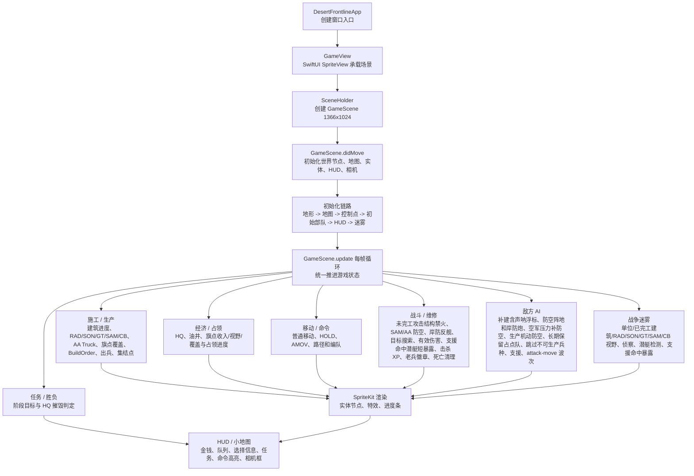
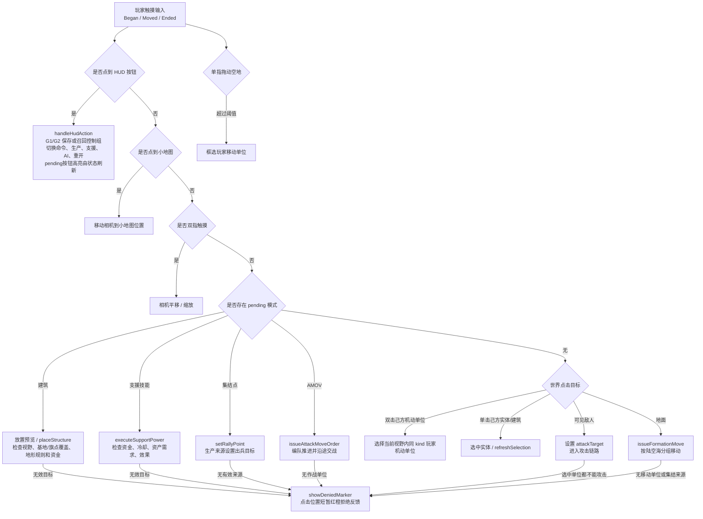
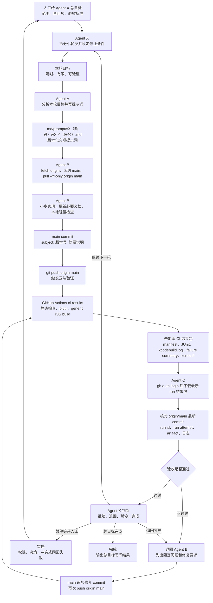

# 项目流程图

本文用 Mermaid 图把 `md/flow/flow.md` 的核心逻辑可视化。每张图前都有中文读图说明，便于人工快速检查当前项目运行链路。

## 1. 项目核心逻辑图

读图说明：从 App 启动开始，SwiftUI 只负责承载 SpriteKit；所有游戏运行态进入 `GameScene`。每帧 update 推进各系统，最后更新节点渲染、HUD、小地图和胜负状态。

## 2. 玩家输入与命令流程图

读图说明：触摸输入会先判断 HUD 和小地图；HUD 可处理控制组保存 / 召回并清理 pending 模式。建筑放置、支援技能、集结点和 attack-move 都是互斥 pending 状态，最后才进入普通选择、攻击或移动；无效世界目标只补短暂拒绝标记，不改变命令合法性或 pending 语义。

## 3. Agent X 主控迭代与云端验证流程图

读图说明：人工可以用 `agentx:` 给出总目标。Agent X 只负责拆分轮次和判断循环状态，不替代 Agent A/B/C。每个轮次仍由 Agent A 写提示词、Agent B 在 `main` 上实现并 push、GitHub Actions 生成未加密 artifact、Agent C 下载核对最新 `origin/main` run；之后 Agent X 才能判断继续、退回、暂停或完成。

