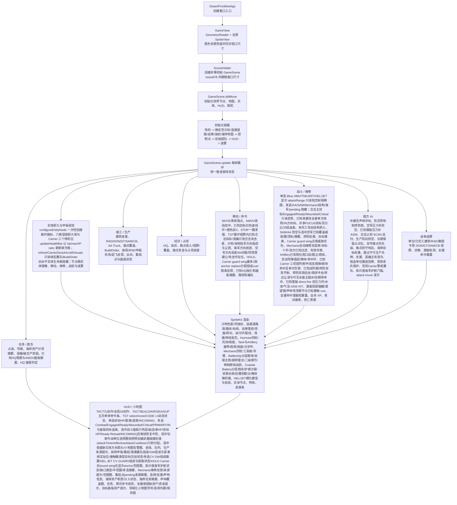
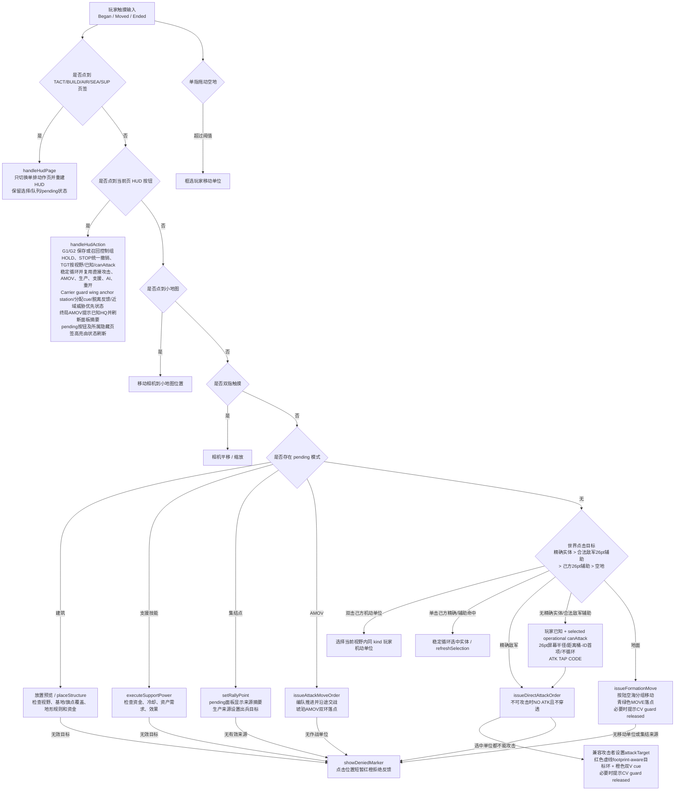
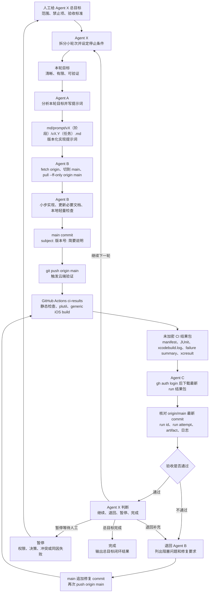

# 项目流程图

本文用 Mermaid 图把 `md/flow/flow.md` 的核心逻辑可视化。每张图前都有中文读图说明，便于人工快速检查当前项目运行链路。

当前版本视觉增量：实体配置阶段创建旗杆阵营旗标旁的六格竖直耐久塔，为单选 Blue 陆空作战单位预创建由既有 `attackRange` 驱动的低透明等距射程椭圆，为 Carrier 预创建三个固定停机位舰载机轮廓，并为 Submarine 创建低对比度艏艉细节与实体本地 `STEALTH` / `SONAR` / `DETECT` / `CONTACT` cue；HUD 选择面板另在写入行文本时使用集中式海空短码与有界单行 fitting；这些节点仍属于实体子树，沿用镜像、迷雾、战损、维修和死亡清理链路，范围、甲板、潜艇 cue 与面板适配都不改攻击或生产规则。

## 1. 项目核心逻辑图

读图说明：从 App 启动开始，SwiftUI 只负责承载 SpriteKit；所有游戏运行态进入 `GameScene`。每帧 update 推进各系统，最后更新节点渲染、HUD、小地图和胜负状态。

```mermaid
flowchart TD
  App["DesertFrontlineApp\n创建窗口入口"] --> View["GameView\nGeometryReader + 全屏 SpriteView\n黑色背景兜底并同步视口尺寸"]
  View --> Holder["SceneHolder\n创建非零初始 GameScene\nresizeFill 并跟随窗口尺寸"]
  Holder --> Scene["GameScene.didMove\n初始化世界节点、地图、实体、HUD、相机"]
  Scene --> Init["初始化链路\n地形 -> 确定性沙纹/连通道路/岩脊/油田/海岸地图 -> 控制点 -> 初始部队 -> HUD -> 迷雾"]
  Init --> Loop["GameScene.update 每帧循环\n统一推进游戏状态"]
  Loop --> Build["施工 / 生产\n建筑进度、RAD/SON/GT/SAM/CB、AA Truck、旗点覆盖、BuildOrder、航母3PAD甲板状态/起飞反馈、出兵、集结点与面板状态"]
  Loop --> Economy["经济 / 占领\nHQ、油井、旗点收入/视野/覆盖、旗点奖金与占领进度"]
  Loop --> Commands["移动 / 命令\nMOVE青绿落点、AMOV琥珀双环、已知目标红色虚线环+橙色双V、STOP一键清理、TGT循环视野内已知合法目标/混编只改合法攻击者、沙地/油地陆军方向胎迹与尘团、海军方向航迹、空军方向投影/84间距/同阵营避让/攻击环站位、HOLD、Carrier guard wing最多2架anchor station/分配组成cue/脱离反馈、已知HQ指引和面板摘要、路径和编队"]
  Loop --> Combat["战斗 / 维修\n单选 Blue HMV/TNK/ART/HEL/JET 显示 attackRange 只读陆空射程椭圆，多选/AA/SAM/Mechanic/结构/海军/pending 隐藏；合法主目标/Engaged/Ready/Wounded/Critical只读态势、已知来袭攻击者单次快照/IN方向标、共享FOCUS目标百分比/分段血条、未完工攻击结构禁火、SAM/AA 防空与选中空军已知覆盖威胁圈/顶标/摘要、岸防反舰、目标搜索、Carrier guard wing近域威胁优先、Mechanic自动维修双层束/目标十字/双方已知过滤、有效伤害、Artillery已知炮位炮口焰/烟尘/炮线、空战导弹烟迹/弹体/命中环、已知 Carrier 三机错列俯冲/双反舰弹/舰体命中且单次伤害、已知战列舰/岸防双发齐射、岸防双炮后坐/炮床冲击/岸边尘浪与可见水面主副水柱/舰体命中、已知潜艇 direct-fire 双压力环/水沫/气泡 ASW HIT、潜艇局部艏艉/潜望镜/声呐穹顶细节与已知接触 cue、支援命中潜艇短暴露、击杀 XP、老兵徽章、死亡清理"]
  Loop --> HealthVisual["实体耐久与甲板视觉\nconfigureEntityNode 一次性创建旗杆旗标、六格竖直耐久塔与 Carrier 三个停机位\nupdateHealthBar 以 hp/maxHP ratio 更新填充格；refreshCarrierDeckAircraftVisuals 只读绑定翼队/BuildOrder\n旧水平实体生命条隐藏；节点随实体镜像、移动、维修、战损与迷雾"]
  HealthVisual --> Render
  Loop --> AI["敌方 AI\n补建含声呐浮标、防空阵地和岸防炮、空军压力补防空、已知潜艇压力补 ASW、合法认知 SCAN 巡扫、生产机动防空、长期保留占点队、反夺旗点优先级、旗点防守响应、海岸目标权重、跳过不可生产兵种、支援、混编主攻波次、低血单位撤退回修、受损老兵保护、空闲Carrier警戒翼队、高价值海军护航门槛、attack-move 波次"]
  Loop --> Fog["战争迷雾\n单位/已完工建筑/RAD/脆弱专职 SON/GT/SAM/CB 视野、侦察、潜艇检测、支援命中暴露"]
  Loop --> Mission["任务 / 胜负\n占油、夺旗、海岸资产分项摘要、混编/破生产奖励、已知HQ情报与AMOV面板摘要、HQ 摧毁判定"]
  Build --> Render["SpriteKit 渲染\n沙地色差/风蚀纹、连通道路肩/路床/标线、岩脊落影/亮面/碎石、油污环/裂纹、浅滩/岸线浪花、Humvee四轮/风挡/枪座、Tank与Artillery履带/炮塔/炮座/光学件、Mechanic四轮/工具舱/吊臂、Battleship分层舰体/双联主炮/舰桥雷达/二级细节/两档舰体战损、Coastal Battery分层炮床/护坡沙袋/双联长炮/后膛测距仪/掩体弹药箱、HEL/JET细化模型与投影、实体节点、特效、进度条"]
  Economy --> Render
  Commands --> Render
  Combat --> Render
  AI --> Render
  Fog --> Render
  Mission --> HUD["HUD / 小地图\nTACT九动作/全局26动作、TACT/BUILD/AIR/SEA/SUP五页单排命令条、TGT select/none/CODE i-n动态状态、单选目标HP/距离/装填/INCOMING、多选Combat/Engaged/Ready/Wounded/Critical/PRIMARY/IN与面板目标血条、选中战斗面板行色层级(自身HP/目标HP/Ready-Reload/INCOMING)且每帧恢复中性、选中玩家作战单位选择圈低侧预创建武器就绪刻度(attackTimer/effectiveAttackCooldown只读分段)、选中受威胁实体方向箭头/小地图告警圈、金钱、队列、生产来源提示、航母甲板/集结/普通翼队组成/GW组成与紧凑绑定站位/接触数类型目标交战状态/多选CV GW组成摘要/HEL-JET CV GUARD组成与距离状态/HOLD Carrier无bound wing也显示anchor范围圈、高价值海军护航状态/缺口类型/半径圈/多选摘要、Mechanic维修反馈/来源提示/范围圈、集结点pending来源摘要、选择/反潜/声呐信息、海岸资产职责/计入状态、海岸任务摘要、声呐覆盖圈、任务、跨页命令高亮、支援按钮缺资产/资金提示、目标面板资产提示、领域化小地图符号/选择外圈/相机框"]
  Render --> HUD
```

## 2. 玩家输入与命令流程图

读图说明：触摸输入会先判断 HUD 和小地图；HUD 可处理控制组保存 / 召回并清理 pending 模式。建筑放置、支援技能、集结点和 attack-move 都是互斥 pending 状态，最后才进入普通选择、攻击或移动；无效世界目标只补短暂拒绝标记，不改变命令合法性或 pending 语义。

```mermaid
flowchart TD
  Touch["玩家触摸输入\nBegan / Moved / Ended"] --> PageCheck{"是否点到 TACT/BUILD/AIR/SEA/SUP 页签"}
  PageCheck -- "是" --> PageSwitch["handleHudPage\n只切换单排动作页并重建HUD\n保留选择/队列/pending状态"]
  PageCheck -- "否" --> HUDCheck{"是否点到当前页 HUD 按钮"}
  HUDCheck -- "是" --> HudAction["handleHudAction\nG1/G2 保存或召回控制组\nHOLD、STOP统一撤销、TGT按视野/已知/canAttack稳定循环并复用直接攻击、AMOV、生产、支援、AI、重开\nCarrier guard wing anchor station/分配cue/脱离反馈/近域威胁优先状态\n终局AMOV提示已知HQ并刷新面板摘要\npending按钮及所属隐藏页签高亮由状态刷新"]
  HUDCheck -- "否" --> MiniMap{"是否点到小地图"}
  MiniMap -- "是" --> Camera["移动相机到小地图位置"]
  MiniMap -- "否" --> MultiTouch{"是否双指触摸"}
  MultiTouch -- "是" --> PanZoom["相机平移 / 缩放"]
  MultiTouch -- "否" --> Pending{"是否存在 pending 模式"}
  Pending -- "建筑" --> Place["放置预览 / placeStructure\n检查视野、基地/旗点覆盖、地形规则和资金"]
  Pending -- "支援技能" --> Support["executeSupportPower\n检查资金、冷却、资产需求、效果"]
  Pending -- "集结点" --> Rally["setRallyPoint\npending面板显示来源摘要\n生产来源设置出兵目标"]
  Pending -- "AMOV" --> AttackMove["issueAttackMoveOrder\n编队推进并沿途交战\n琥珀AMOV双环落点"]
  Place -- "无效目标" --> Denied["showDeniedMarker\n点击位置短暂红橙拒绝反馈"]
  Support -- "无效目标" --> Denied
  Rally -- "无有效来源" --> Denied
  AttackMove -- "无作战单位" --> Denied
  Pending -- "无" --> WorldTap{"世界点击目标\n精确实体 > 合法敌军26pt辅助\n> 己方26pt辅助 > 空地"}
  WorldTap -- "双击己方机动单位" --> TypeSelect["选择当前视野内同 kind 玩家机动单位"]
  WorldTap -- "单击己方精确/辅助命中" --> Select["稳定循环选中实体 / refreshSelection"]
  WorldTap -- "精确敌军" --> Attack["issueDirectAttackOrder\n不可攻击时NO ATK且不穿透"]
  WorldTap -- "无精确实体/合法敌军辅助" --> AssistAttack["玩家已知 + selected operational canAttack\n26pt屏幕半径/距离桶-ID首项/不循环\nATK TAP CODE"]
  AssistAttack --> Attack
  Attack --> AttackResult["兼容攻击者设置attackTarget\n红色虚线footprint-aware目标环 + 橙色双V cue\n必要时提示CV guard released"]
  WorldTap -- "地面" --> Move["issueFormationMove\n按陆空海分组移动\n青绿色MOVE落点\n必要时提示CV guard released"]
  Attack -- "选中单位都不能攻击" --> Denied
  Move -- "无移动单位或集结来源" --> Denied
  Touch --> Drag{"单指拖动空地"}
  Drag -- "超过阈值" --> Box["框选玩家移动单位"]
```

## 3. Agent X 主控迭代与云端验证流程图

读图说明：人工可以用 `agentx:` 给出总目标。Agent X 只负责拆分轮次和判断循环状态，不替代 Agent A/B/C。每个轮次仍由 Agent A 写提示词、Agent B 在 `main` 上实现并 push、GitHub Actions 生成未加密 artifact、Agent C 下载核对最新 `origin/main` run；之后 Agent X 才能判断继续、退回、暂停或完成。

```mermaid
flowchart TD
  Human["人工给 Agent X 总目标\n范围、禁止项、验收标准"] --> AgentX["Agent X\n拆分小轮次并设定停止条件"]
  AgentX --> RoundGoal["本轮目标\n清晰、有限、可验证"]
  RoundGoal --> AgentA["Agent A\n分析本轮目标并写提示词"]
  AgentA --> Prompt["md/prompt/vX（阶段）/vX.Y（任务）.md\n版本化实现提示词"]
  Prompt --> Sync["Agent B\nfetch origin、切到 main、pull --ff-only origin main"]
  Sync --> Implement["Agent B\n小步实现、更新必要文档、本地轻量检查"]
  Implement --> Commit["main commit\nsubject: 版本号: 简要说明"]
  Commit --> Push["git push origin main\n触发云端验证"]
  Push --> Actions["GitHub Actions ci-results\n静态检查、plutil、generic iOS build"]
  Actions --> Artifact["未加密 CI 结果包\nmanifest、JUnit、xcodebuild.log、failure summary、xcresult"]
  Artifact --> AgentC["Agent C\ngh auth login 后下载最新 run 结果包"]
  AgentC --> Verify["核对 origin/main 最新 commit\nrun id、run attempt、artifact、日志"]
  Verify --> Gate{"验收是否通过"}
  Gate -- "不通过" --> BackB["退回 Agent B\n列出阻塞问题和修复要求"]
  BackB --> Fix["main 追加修复 commit\n再次 push origin main"]
  Fix --> Actions
  Gate -- "通过" --> XJudge["Agent X 判断\n继续、退回、暂停、完成"]
  XJudge -- "继续下一轮" --> AgentX
  XJudge -- "退回补充" --> BackB
  XJudge -- "暂停等待人工" --> Pause["暂停\n权限、决策、冲突或同因失败"]
  Pause --> Human
  XJudge -- "总目标完成" --> Done["完成\n输出总目标闭环结果"]
```

- v4.81：选中玩家机动单位显示分色命令意图线（攻/移/AMOV/HOLD），只读刷新。

- v4.82：可见命中显示短促伤害飘字，只读、不改结算。

- v4.83：多选共用攻击目标显示 `FOCUS n` 集火标，只读。

- v4.84：选中战列舰/岸防炮显示舰炮射程圈，只读。

- v4.85：分层爆炸特效；多选面板 `FOCUS n Tgt` 摘要。

- v4.86：Tank 分层履带 / 炮塔 / 光学件模型；CI 新增独立 land focus 截图探针。

- v4.87：Artillery 履带 / 战斗室 / 长炮管模型；已知炮位炮口焰 / 烟尘，land probe 冻结炮线样本。

- v4.88：Humvee 四轮装甲侦察车模型；机动陆军预创建沙地 / 油地方向胎迹与尘团，land probe 冻结双方 Humvee 扬尘。

- v4.89：Mechanic 四轮工程车模型；预创建自动维修双层束与目标十字，land probe 冻结双方已知维修链路。

- v4.90：确定性沙地色差 / 风蚀纹、按正交邻格连通的分层道路、山脊落影 / 亮暗面 / 碎石和油田污环 / 裂纹；CI 新增第十次 coast focus 地图截图探针。

- v4.91：单选 / 多选战斗态势、面板主目标生命条、共享 FOCUS 目标短码 / 百分比 / 八段耐久；CI 新增第十一次 combat-ui 截图探针。

- v4.92：玩家已知来袭攻击者单次快照、单选 / 多选 `IN` 摘要、选中目标方向箭头 / 标签和小地图告警圈；CI 新增第十二次 incoming-ui 截图探针。

- v4.93：Battleship 分层舰体与双联主炮模型、双发舰炮齐射和复合水面命中；CI 新增第十三次 naval-salvo 截图探针。

- v4.94：Coastal Battery 分层炮床、双联岸炮与后坐 / 尘浪反馈；CI 新增第十四次 coastal-battery 截图探针。

- v4.95：Carrier 三机错列俯冲、双反舰弹与舰体命中；CI 新增第十五次 carrier-strike 截图探针。
- v4.96：AA Truck 六轮雷达发射车模型、双弹错发与雷达跟踪反馈；CI 新增第十六次 mobile-aa 截图探针。
- v4.97：Fighter 对水面舰艇 / 建筑使用双曲线翼下导弹、专用紧凑命中；CI 新增第十七次 fighter-strike 截图探针。
- v4.98：Helicopter 双侧 pod 四枚短火箭、离散烟点与专用紧凑命中；CI 新增第十八次 helicopter-salvo 截图探针。
- v4.99：机动地面 / 空中 / 水面单位预创建两档持续受损状态，单选 HP 行追加 `DMG/CRIT`；CI 新增第十九次 damage-state 截图探针。
- v5.0：TACT 新增动态 `STOP`，统一撤销选中玩家机动单位的 move / path / attack / AMOV / HOLD / Carrier guard anchor，保留选择并显示 `STOP n`；CI 新增第二十次 stop-command 截图探针。
- v5.1：TACT 新增 `TGT`，按当前视野、玩家已知与 `canAttack` 边界稳定循环目标，并让地图点击与循环集火共享攻击执行；CI 新增第二十一次 target-cycle 截图探针。
- v5.2：玩家己方选择新增 26pt 屏幕尺度辅助半径与重叠候选稳定循环，精确敌军攻击和双击同型选择保持；CI 新增第二十二次 selection-cycle 截图探针。
- v5.3：普通点击在精确实体之后、友军辅助之前增加合法敌军 26pt 屏幕尺度辅助攻击，按距离桶 / id 取首项且不循环，继续复用直接攻击 helper；CI 新增第二十三次 enemy-touch-assist 截图探针。
- v5.12：选中 Blue 作战机动单位的选择圈低侧增加四个预创建武器就绪刻度，ready 显示青绿色、装填按 `attackTimer / effectiveAttackCooldown` 只读逐段显示琥珀；敌军、结构、Mechanic、pending / 空选择隐藏，复用二十四次既有云端截图探针。
- v5.14：Carrier 实体树新增三个固定停机位舰载机轮廓；`refreshCarrierDeckAircraftVisuals()` 只读 Carrier HOLD 绑定翼队与 HEL/JET BuildOrder，绑定机体提亮、队列显示琥珀条、空位保持暗色，选中航母面板使用 `Deck 3PAD H/J`；不新增实体、生产、攻击或第 25 次截图探针。
- v5.16：海空选择信息面板在保留原始事实 rows、颜色索引与目标血条的前提下，集中压缩 `ASW` / `SON` / `Rld` / `RLY` / `Q` / `W` / `GW` / `Esc` 等展示 token，并按缓存面板宽度做有界单行字号 / 水平 fitting；不新增状态、控件或第 25 次探针。
